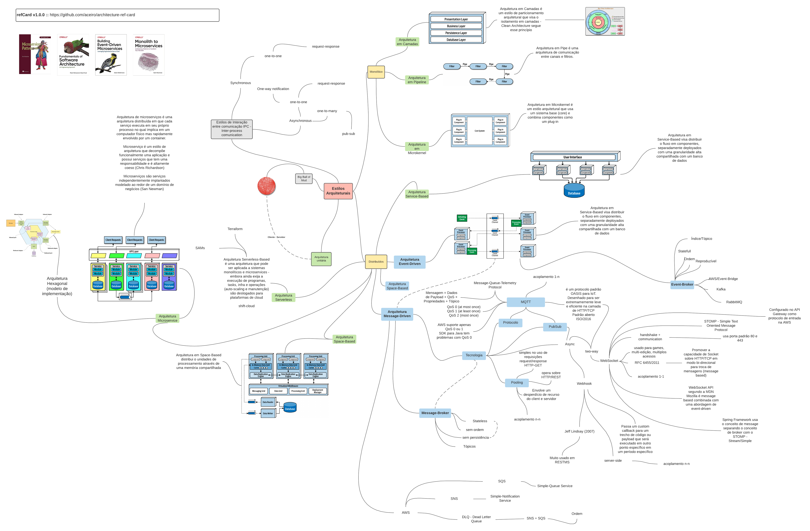

# refCard sobre Arquitetura (v1.0.0)
Esse é um refCard (aka., Reference Card) sobre arquitetura. Nesse refCard você encontra:
- Um comjunto de definições sobre estilos arquiteturais
- Padrões, Técnicas e Ferramentas frequentemente utilizados

Esse não é uma modelo ou uma Arquitetura de Referência. 

Você pode entender esse refCard como um mapa-mental (_mind-map_) conectando conceitos, termos e definições importantes sobre arquitetura de software em geral. As definições apresentadas aqui foram extraídas a partir das referencias indicadas.

